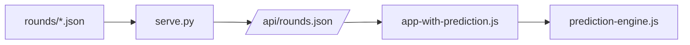

# Kế hoạch: engine dự đoán Xóc Đĩa trên [analytics](analytics/)

## Cơ sở hiện có

- **[analytics/app.js](analytics/app.js)**: `fetch("/api/rounds.json")` mỗi 3 giây; `toItem()` map `dice_result` → `red` (0–4) và `type` (`chan` / `le`); `filtered()` theo `fromDate`/`toDate`; render thống kê và Big Road (6 hàng).
- **[analytics/serve.py](analytics/serve.py)**: phục vụ static từ `analytics/`, API là mảng JSON từ `rounds/*.json`.
- **Dữ liệu mỗi phiên**: `round_id`, tùy chọn `started_at`, `dice_result` (xem [README.md](README.md)).

Ràng buộc cho engine: đầu vào là mảng **đã chuẩn hóa** `RoundItem[] = { red, type, time, round_id? }` (giống sau `toItem`), để không nhân đôi map `DICE_TO_RED` trong core — chỉ tái sử dụng kiểu ở lớp tích hợp.

## Vị trí file (chỉnh cho repo này)

Trong bản gốc có thư mục `xoc-dia-prediction/`. Với repo hiện tại, hợp lý đặt **trong [analytics/](analytics/)** (không cần sửa `directory=str(STATIC_DIR)` trong `serve.py`): ví dụ `analytics/prediction-engine.js`, `analytics/app-with-prediction.js`, `analytics/index-with-prediction.html`. Sau nếu muốn tách folder riêng có thể symlink hoặc đổi cấu hình serve — không bắt buộc giai đoạn đầu.

## PHASE 1 — Core thuật toán (`prediction-engine.js`)

Contract thống nhất mỗi predictor:  
`(history: RoundItem[], context?: { now?: Date }) → { name, predictedRed: 0..4, confidence: 0..1, reason: string }`  
(hoặc object tương đương cho ensemble). `history` là danh sách **theo thời gian** các phiên đã kết thúc (phần tử cuối = kết quả mới nhất).

| Module                  | Ý tưởng triển khai trên `red` / `type` / `time`                                                                                                                                                                                                       |
| ----------------------- | ----------------------------------------------------------------------------------------------------------------------------------------------------------------------------------------------------------------------------------------------------- |
| **PatternMatcher**      | Chuỗi `red[]`: với độ dài L ∈ [2,7], tìm suffix trùng prefix đã xuất hiện trước đó; vote theo tần suất tiếp theo; confidence phụ thuộc L và số lần khớp (smoothing tần suất).                                                                         |
| **StreakAnalyzer**      | Độ dài streak `chan`/`le` hiện tại; phân phối độ dài streak trong `history`; heuristic: streak rất dài → hơi nghiêng đảo chiều, streak ngắn → hơi nghiêng tiếp tục; map ra `predictedRed` cụ thể (parity + tie-break theo tần suất mặt trong streak). |
| **FrequencyBalancer**   | Cửa sổ 30 phiên gần nhất: tỉ lệ `chan` < 0.45 → nghiêng `chan` (chọn `red` parity phù hợp); tương tự từng mặt 0–4 về mục ~20% (ví dụ thiếu 3 → ưu tiên `red===3`).                                                                                    |
| **MarkovPredictor**     | Ma trận chuyển `P(red_next \| red_last)` + Laplace smoothing; dự đoán argmax; confidence = xác suất chuẩn hóa của outcome tốt nhất. “Cập nhật theo thời gian” = tính trên toàn bộ `history` truyền vào (cửa sổ trượt do backtest/UI quyết định).      |
| **HotColdAnalyzer**     | Cửa sổ W ∈ [20,50]: nóng = tần suất cao ở đuôi; lạnh = đã lâu không ra; gộp score 0–4 rồi chuẩn hóa thành confidence.                                                                                                                                 |
| **TimePatternAnalyzer** | Từ `time`: bucket theo giờ trong ngày và ngày trong tuần; tần suất có điều kiện của `red` hoặc parity; bucket thiếu dữ liệu → prior đều + confidence thấp.                                                                                            |

**EnsemblePredictor**: bỏ phiếu có trọng số theo `predictedRed` (trọng số = confidence hoặc `confidence²`); tổng hợp: số + parity, confidence trung bình có trọng số, **consensus** = tỉ lệ thuật toán (hoặc tỉ lệ trọng số) đồng ý lớp mode (nên cố định rule: cùng `red` hay cùng parity — ghi rõ trong code và UI).

**Lưu ý (đánh giá & trách nhiệm)**: Nếu phiên là ngẫu nhiên công bằng, chiến lược tối ưu lý thuyết ~20% exact và ~50% đúng chẵn/lẻ; lệch trên mẫu hữu hạn không chứng minh “có quy luật”. Metrics PHASE 6 dùng để **hiệu chỉnh heuristic trên lịch sử**, không phải bảo đảm lợi nhuận tương lai.

## PHASE 2 — Tích hợp

- **[analytics/app-with-prediction.js](analytics/)** (file mới): sao chép/tái dùng logic [app.js](analytics/app.js) (fetch, `toItem`, filter, `render`), **giữ nguyên** hành vi panel cũ.
- Sau `refresh()` + `render()` thành công: lấy `filtered()` (cùng khoảng user đang xem), gọi `EnsemblePredictor.predict(filtered())`, ghi DOM panel dự đoán.
- **So sánh real-time**: khi `masterData.length` tăng, giữ “dự đoán trước phiên mới nhất” trong bộ nhớ và so với `red` thực tế của phiên vừa tới; cập nhật buffer độ chính xác (10/30/tổng) và counter theo từng thuật toán.

Thứ tự script HTML: `prediction-engine.js` trước, `app-with-prediction.js` sau.

## PHASE 3 — UI ([analytics/index-with-prediction.html](analytics/))

- Tái dùng style [index.html](analytics/index.html) (Tailwind CDN + class card).
- Ba vùng như mockup: **Prediction Dashboard** (số lớn, Chẵn/Lẻ, thanh confidence, consensus, `reason` ngắn); **bảng 6 thuật toán**; **accuracy / track record** (10 phiên ✓/✗, 30 và tổng, best/worst algorithm).
- Ngôn ngữ giao diện: **tiếng Việt** (nhất dự án).

## PHASE 4 — Tính năng nâng cao

- **Backtest**: hàm riêng trong `prediction-engine.js` (hoặc `prediction-backtest.js`): với mỗi `t`, dự đoán từ `history[0:t]`, so với `history[t].red`; gom metrics theo thuật toán và ensemble; UI: cùng bộ lọc ngày + nút chạy backtest + bảng/kết quả.
- **Alerts**: confidence và consensus vượt ngưỡng → banner trong trang; tùy chọn `Notification` API sau khi user bật quyền.
- **Export**: `Blob` + tải JSON/CSV (tóm tắt dự đoán, metrics backtest).

## PHASE 5 — Roadmap tuần

- **Tuần 1**: `prediction-engine.js` đủ 6 module + `EnsemblePredictor`; unit test trên chuỗi giả lập (`node --test` không npm, hoặc `package.json` + vitest).
- **Tuần 2**: `index-with-prediction.html` + `app-with-prediction.js`, poll 3s, cập nhật panel dự đoán và accuracy cơ bản khi có phiên mới.
- **Tuần 3**: UI backtest, metrics chi tiết theo algorithm, alerts.
- **Tuần 4**: polish UX, hiệu năng (Markov + quét pattern có thể giới hạn N≈500–2000 phiên gần nhất), test tay trên dump thật.

## PHASE 6 — Metrics

Trong code: **Exact** (trùng `red`), **Type** (trùng chẵn/lẻ); calibration — bin “confidence vs tỉ lệ đúng”; correlation consensus vs hit rate trên cửa sổ backtest. Baseline (random, pattern đơn giản) hiển thị trong báo cáo backtest để so sánh.

## Artifact hiện có

- **[tests/test_ocr_postprocess.py](tests/test_ocr_postprocess.py)**: OCR; engine JS cần **test mới** cạnh `prediction-engine.js` hoặc `analytics/__tests__/`.

## Kết luận

Bước tối thiểu sau khi duyệt: file core + test + entry HTML mới, **không** sửa [analytics/index.html](analytics/index.html) và [analytics/app.js](analytics/app.js) cho đến khi ổn; sau đó README: “analytics mở rộng: `/index-with-prediction.html`”.
